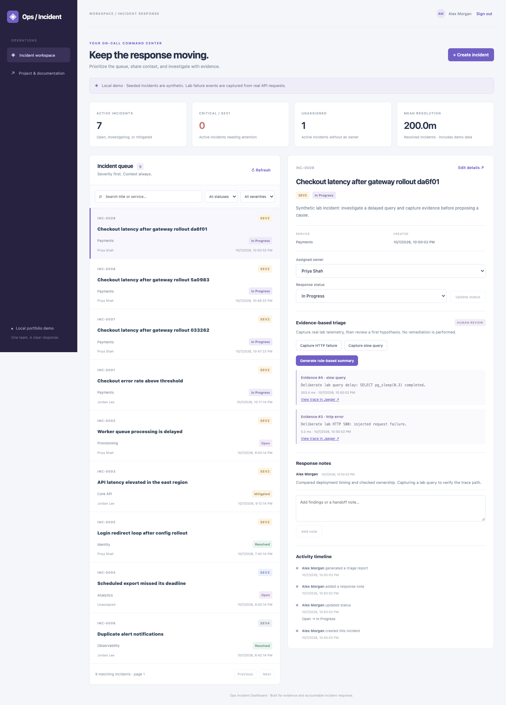
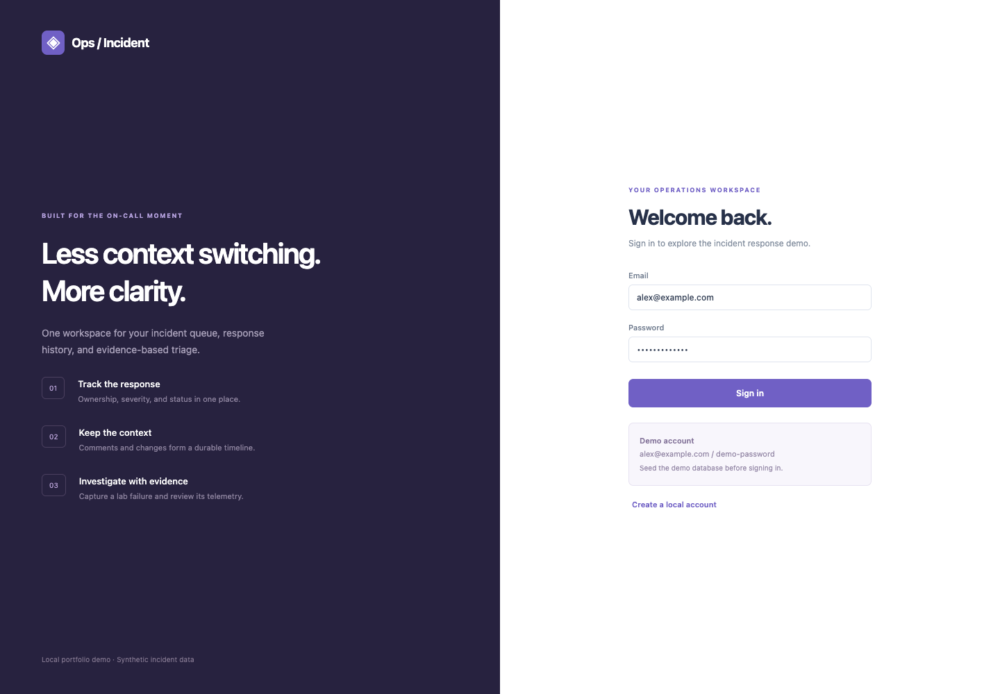
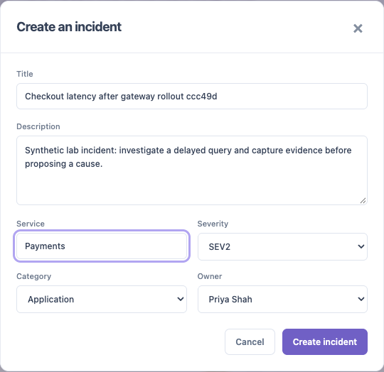
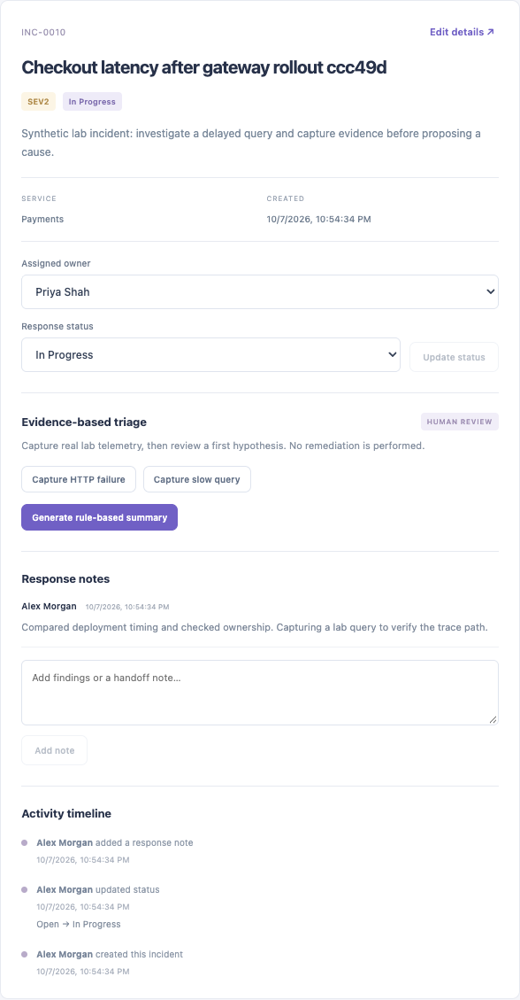
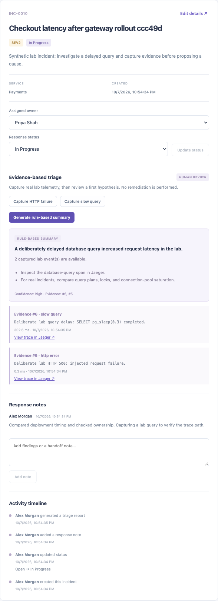
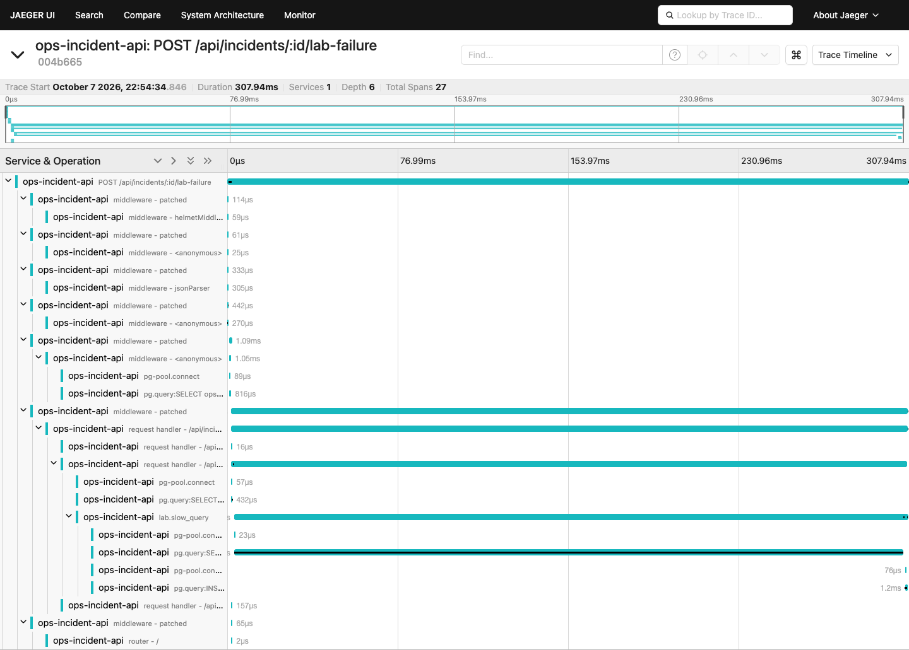
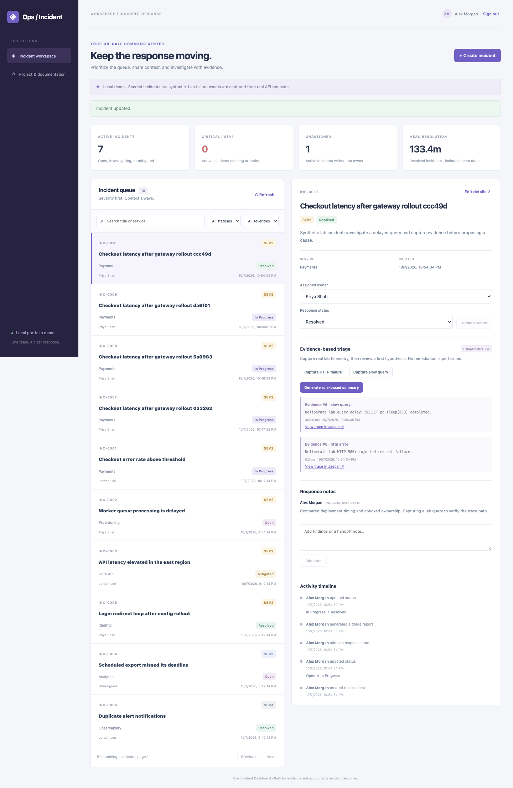
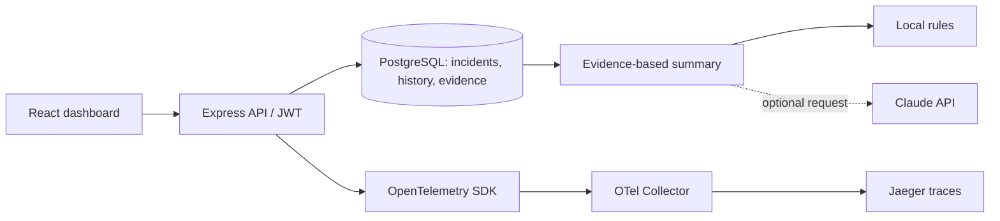

# Ops Incident Dashboard

A local incident-response workspace: track ownership and status, record response notes, capture real lab traces, and review an evidence-linked first hypothesis.



**Stack:** React · Node.js / Express · PostgreSQL · OpenTelemetry · Jaeger · Docker Compose · optional Claude API.

## Run the demo

Install Docker with Compose, then run from this repository:

```bash
docker compose up -d --build
docker compose ps
```

Open **http://localhost:5001**. Sign in with `alex@example.com` / `demo-password`. Jaeger runs at **http://localhost:16686**. First startup downloads images, runs migrations, and seeds six synthetic incidents and three demo accounts. Wait for the app and database to become healthy.

The demo uses its own named PostgreSQL volume and port `55432`; it does not use your existing backend `.env` or database. `docker compose down` stops services and keeps incident records. The public demo credentials and signing secret are intended for this loopback-only local setup.

## Implemented

- Signup/login with scrypt password hashing and expiring JWTs. The UI keeps tokens in memory; reloading signs you out.
- Search, severity/status filters, pagination, ownership, creation/editing, and response metrics.
- Comments, status history, and activity audit records in database transactions.
- Optimistic concurrency: stale edits return 409. Status transitions are validated.
- API soft archiving preserves history.
- SQL migrations, repeatable seeding, integration tests, and GitHub Actions.
- Actual HTTP 500 and delayed PostgreSQL query scenarios, traced through the OTel Collector into Jaeger.
- Evidence-linked rule summaries and an optional Claude integration that validates structured output and evidence IDs.
- Responsive React interface and reproducible walkthrough screenshots.

## Demo walkthrough

1. **Sign in** using the account above, or register a new account.

   

2. **Review the workspace.** Check active/critical incidents, ownership, and response status. Search or filter the queue.

3. **Create an incident.** Click **+ Create incident**, enter a title/description, choose `SEV2`, service `Payments`, and owner `Priya Shah`.

   

4. **Start responding.** Select `In Progress`, click **Update status**, and add a response note. Activity records show who changed what.

   

5. **Capture evidence.** Click **Capture HTTP failure**, then **Capture slow query**. The first deliberately returns HTTP 500; the second executes `SELECT pg_sleep(0.3)`. Click **Generate rule-based summary** to review the hypothesis and evidence IDs.

   

6. **Inspect Jaeger.** Click **View trace in Jaeger ↗**. Inspect the API request and database spans. Allow a few seconds for trace export.

   

7. **Resolve.** Select `Resolved` and click **Update status**. History stays available, the incident remains searchable, and metrics update.

   

Interview walkthrough: “I built an incident workspace with audited state changes and optimistic concurrency. I can inject an actual API failure or slow database query, follow its OpenTelemetry trace in Jaeger, and generate a first hypothesis that cites captured evidence. Resolution remains with the responder.”

## Architecture



Summaries read stored lab observations, including trace IDs and measured query duration. They do **not** retrieve arbitrary spans from Jaeger or ingest production logs. HTTP exceptions appear as span events; lab observations are persisted in PostgreSQL. OpenTelemetry log export is not implemented. Seeded incidents are fictional; captured requests and exported traces are real.

## Optional Claude

The complete local walkthrough works without an API key. Set `ANTHROPIC_API_KEY` and `ANTHROPIC_MODEL` in your shell or an ignored root `.env`, choosing a model available to your Anthropic account, then run `docker compose up -d app`.

The separate Claude button explains that it sends this incident's captured lab telemetry externally. Account records, descriptions, response notes, and passwords are excluded. Structured reports contain a hypothesis, confidence, next steps, and validated evidence IDs. No remediation runs automatically. Live Claude calls require your credentials and are not part of local verification.

## Development and verification

Use Node.js **22.12+**:

```bash
npm ci --prefix backend
npm ci --prefix frontend
npm run build
npm run format:check
```

To develop outside the app container, run `docker compose stop app`. Configure `backend/.env` using [backend/.env.example](backend/.env.example), backing up existing configuration and using a **fresh demo database**. Run `npm --prefix backend run dev` and `npm --prefix frontend run dev`. Vite proxies `/api` to port 5001. Migrations create the new schema; importing a legacy database needs a separate migration plan.

Create the isolated test database once, then run integration tests:

```bash
docker compose exec db createdb -U ops_demo ops_dashboard_test
npm test
```

If the database exists, skip `createdb`. Tests require database names ending in `_test`; set `TEST_DATABASE_URL` for another dedicated database. CI starts its own PostgreSQL service and runs tests, build, and formatting.

For screenshots, create a Python virtual environment, install [scripts/requirements-browser.txt](scripts/requirements-browser.txt), install Chromium with `python -m playwright install chromium`, and run `python scripts/browser_smoke.py` against the running Docker demo. Installed Google Chrome is also supported. Each run creates one synthetic incident and verifies browser interactions, trace delivery, and mobile layout. See [verification](docs/verification.md).

## API

Authenticated routes require `Authorization: Bearer <token>`. Writes require `Content-Type: application/json`.

| Method | Route | Purpose |
| --- | --- | --- |
| POST | `/api/auth/register`, `/api/auth/login` | Create account / obtain token |
| GET | `/api/auth/me`, `/api/config` | Current user / demo features |
| GET | `/api/incidents` | Queue: `q`, `status`, `severity`, `assigned_to`, `page`, `limit` |
| POST | `/api/incidents` | Create an Open incident |
| GET | `/api/incidents/:id` | Detail, comments, history, activity, telemetry |
| PATCH / PUT | `/api/incidents/:id` | Partial update; include current `version` |
| DELETE | `/api/incidents/:id` | Archive; history remains stored |
| POST | `/api/incidents/:id/comments` | `{ "body": "Response note" }` |
| POST | `/api/incidents/:id/lab-failure` | `{ "scenario": "http_error" }` or `slow_query` |
| POST | `/api/incidents/:id/summary` | `{ "provider": "rules" }` or `claude` |
| GET | `/api/metrics` | Response metrics |
| GET / POST | `/api/users` | List responders / create account |
| GET | `/api/users/:id` | Public responder fields |
| GET | `/health` | Database readiness; unauthenticated |

Queue responses use `{ items, total, page, limit }`. Example update: `{ "status": "In Progress", "version": 1 }`. Stale updates return 409; refresh before retrying. Authenticated demo users share one workspace; Lead/Engineer labels do not impose authorization boundaries.

## Remaining scope

The local portfolio MVP is implemented. [Roadmap](docs/roadmap.md) tracks pgvector retrieval, runbook citations, production telemetry ingestion, scoped permissions, and hosted deployment. Hosted use needs separate secrets, authentication policy, database migrations/backups, and disabled demo seeding/failure injection. No cloud deployment is included.
